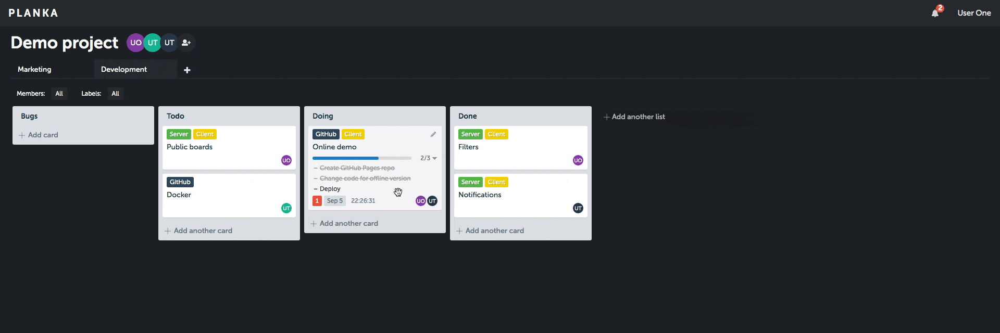

# Planka

Elegant open source project tracking - an independent, modernized fork.

> A fork of [PLANKA](https://github.com/plankanban/planka) by Maksim Eltyshev,
> based on the last AGPL-3.0 release **v1.26.3** (commit `0c2ba9e3`).
> Maintained independently. Licensed under **AGPL-3.0**.
> Not affiliated with or endorsed by PLANKA.

## What this fork adds

- WYSIWYG rich-text editing for card descriptions and comments - markdown still supported
- Security backports on the 1.26.3 base - path-traversal fix, SSRF hardening *(in progress)*
- A few other modernizing improvements *(in progress)*

## Features

- Projects, boards, lists, cards, labels and tasks
- Card members, time tracking, due dates, attachments, comments
- Filter by members and labels
- Customizable project backgrounds
- Real-time updates and internal notifications
- Multiple interface languages
- Single sign-on via OpenID Connect

## Deployment

Build and run with the included `Dockerfile` / `docker-compose.yml`.
Configuration follows the standard PLANKA environment variables.

## Tech stack

- React, Redux, Redux-Saga, Redux-ORM
- Sails.js, Knex.js
- PostgreSQL

## Credits

This project is a fork of **[PLANKA](https://github.com/plankanban/planka)**, created by
Maksim Eltyshev and built by its contributors. Huge thanks to everyone who shaped the original project.

## License

[AGPL-3.0](./LICENSE). Original work © Maksim Eltyshev and PLANKA contributors; modifications © Orne Iasson.
